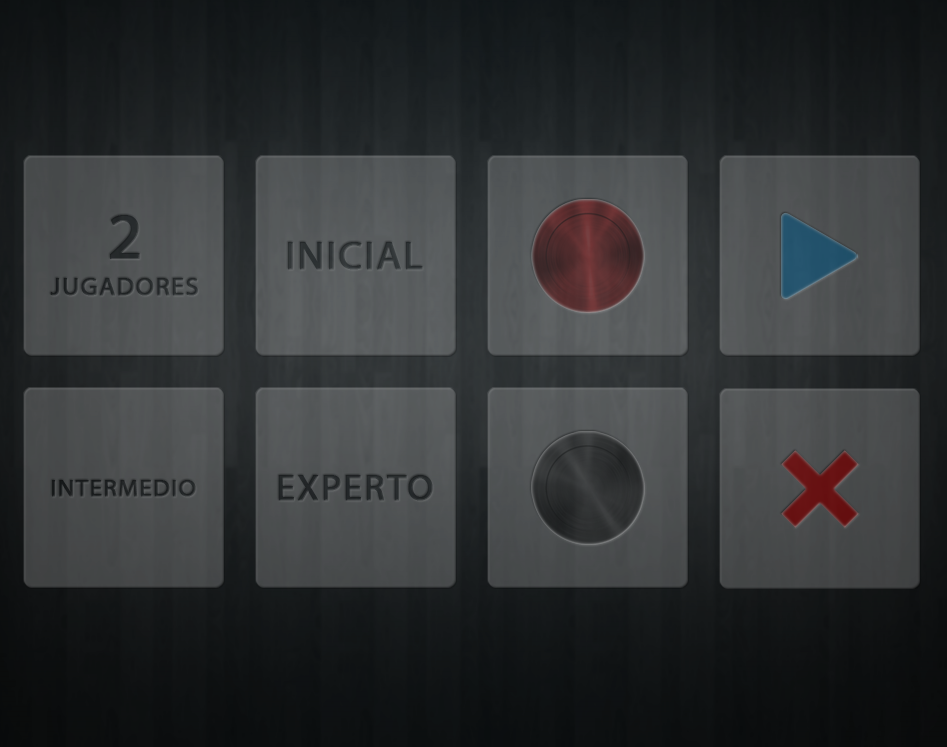
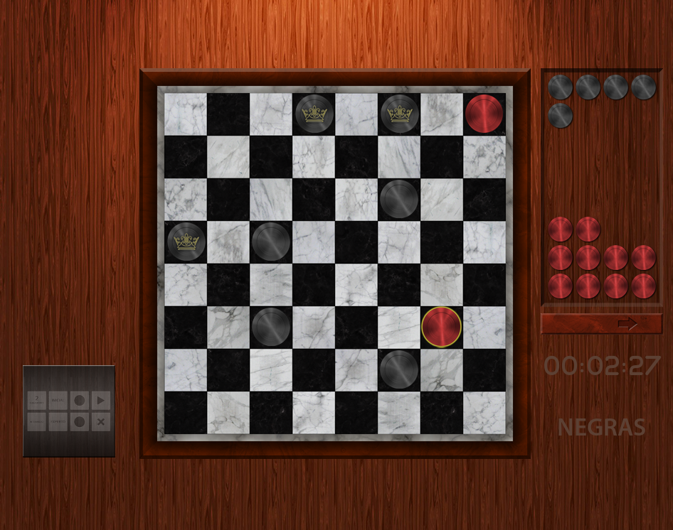

# Checkers
Checkers game based on [MiniMax Algorithm](https://en.wikipedia.org/wiki/Minimax). This is final the project for the Artifical Intelligence class (2013) at [National University of Rosario (UNR)](https://web.fceia.unr.edu.ar/es)'s Computer Science course. Also contributed to this work Natalia Eyherabide ([@enati](https://github.com/enati)) and Alejo Rios ([@alejolcc](https://github.com/alejolcc)).

First "serius" python project. Not the best code we've ever written, but had a lot of fun doing this. I found an abandoned C implementation of the engine in an old hard drive. I completed it (removed memory leaks, fixed some bugs, refactored some of the functions) and changed the rules (now it is mandatory to jump if you can). Not the best C code we've ever written 😂.

The project lacks of tests, it would be good to test at least the engine. Most comments explaining the code are in spanish, sorry for that.

## Requirements

- virtualenv >= 15.1.0
- gcc >= 8.3.0
- python = 2.7.16
- make >= 4.2.1

## Setup

```make install```

## Play

```make run```

## Rules
- Red pieces always starts the game.
- All movements are diagonal.
- Common pieces can move one position at a time, and can't go backwards.
- Crowned pieces are not limited to one position at a time and can move forward and backwards.
- It is mandatory to jump if you have the opportunity. If you can jump more than one piece, you are free to choose which one you want to jump.

## Screens


